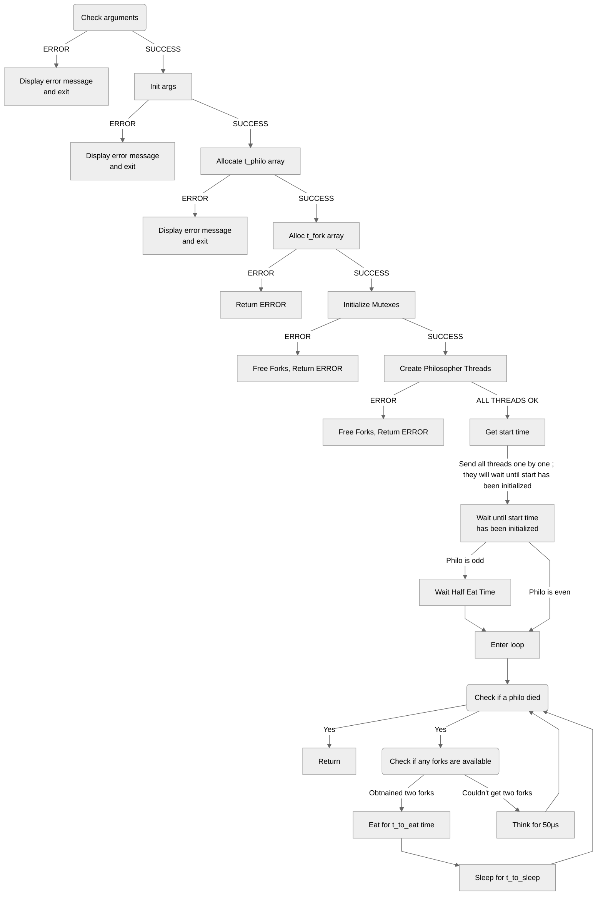

<p align="center">
  
</p>
<p align="center">
<h1 align="center"></h1>
</p>
<em>
<p align="center">
Philosophers is an introduction to concurrent programming and ressource sharing.
<p align="center">
`n` philosophers sit at a round table with a bowl of spaghetti in the center and `n` forks at their disposal.They alternately eat, think, and sleep. To eat, they need to hold two forks (one in each hand). When not eating, they either think or sleep.The simulation stops when a philosopher dies of starvation. Philosophers should avoid starving, and they don’t communicate with each other. 
</p>
</p>
</em>

### Requirements
---
### Overview

**Program Requirements**

**Arguments:**
**- number_of_philosophers**: Number of philosophers and forks.
**- time_to_die**: Time in milliseconds a philosopher can go without eating before dying.
**- time_to_eat**: Time in milliseconds it takes for a philosopher to eat.
**- time_to_sleep**: Time in milliseconds a philosopher sleeps.
**- [number_of_times_each_philosopher_must_eat] (optional)**: If all philosophers have eaten this number of times, the simulation stops.

### Rules:
- Global variables are forbidden.
- Philosophers are identified by numbers (1 to number_of_philosophers).
- Philosopher 1 sits next to philosopher number_of_philosophers, and others sit between their neighbors.
- Each philosopher’s actions (taking a fork, eating, sleeping, thinking, dying) should be logged with a timestamp in milliseconds and the philosopher’s number.
- Logs should not overlap, and a death should be logged within 10 ms of the actual event.

### Implementation

**- Functions Allowed**: memset, printf, malloc, free, write, usleep, gettimeofday, pthread_create, pthread_detach, pthread_join, pthread_mutex_init, pthread_mutex_destroy, pthread_mutex_lock, pthread_mutex_unlock
**- Thread Management**: Each philosopher is a thread. Forks between philosophers are protected with mutexes to prevent duplication.

**Key Points**

- The program should handle threads and mutexes to simulate philosophers' actions.
- Proper synchronization is crucial to avoid data races.
- The implementation should ensure that no philosopher starves and that logs are accurate and timely.

### Structures
---
**1. t_fork**
Used by philosophers to eat ; there is as many forks as there is philosophers and each philosophers needs two forks to eat.

```
typedef struct s_fork
{
    bool            fork;           // Indicates if the fork is available (true) or not (false)
    pthread_mutex_t mfork;          // A mutex to synchronize access to the fork, preventing race conditions
} t_fork;
```
**2. t_arg**
This structure holds the shared ressources for the philosophers:

```
typedef struct s_arg
{
    bool            died;           // Indicates if any philosopher has died
    pthread_mutex_t init_lock;      // Mutex to protect initialization
    pthread_mutex_t write_lock;     // Mutex to protect writing output
    ssize_t         max_meals;      // Maximum number of meals a philosopher can eat (if applicable)
    ssize_t         n_philo;        // Number of philosophers
    struct timeval  start;          // Starting time of the simulation
    t_fork          *arfork;        // Array of forks, used to hold all the forks.
    time_t          t_die;          // Time to die (maximum time a philosopher can go without eating)
    time_t          t_eat;          // Time it takes for a philosopher to eat
    time_t          t_sleep;        // Time it takes for a philosopher to sleep
} t_arg;
```
**3. t_philo**
This structure represents an individual philosopher:

```
typedef struct s_philo
{
    int             phid;           // Philosopher's ID
    pthread_mutex_t time_lock;      // Mutex to protect access to the last_ate time
    pthread_mutex_t var_lock;       // Mutex to protect access to the philosopher's variables
    pthread_t       tid;            // Thread ID of the philosopher's thread
    ssize_t         nb_ate;         // Number of times the philosopher has eaten
    struct timeval  last_ate;       // The last time the philosopher ate
    t_arg           *arg;           // Pointer to the shared arguments and resources
    t_fork          *fork[2];       // Pointers to the two forks the philosopher can access in arfork
} t_philo;
```
### Logic graph
---


### Ressources {#ressources}
---
- [The Dining Philosophers Problem](https://medium.com/swlh/the-dining-philosophers-problem-bbdb92e6b788)
- [Threads, mutex and concurrent programming in C](https://www.codequoi.com/en/threads-mutexes-and-concurrent-programming-in-c/)
