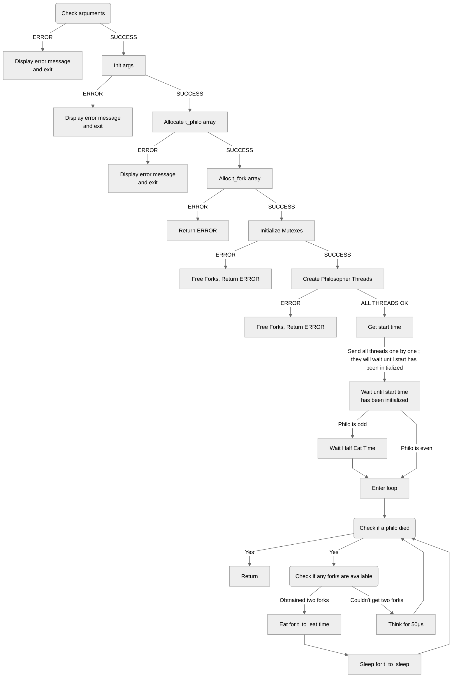

<p align="center">
  
</p>
<p align="center">
<h1 align="center"></h1>
</p>
<em>
<p align="center">
Philosophers is an introduction to concurrent programming and ressource sharing.
<p align="center">
`n` philosophers sit at a round table with a bowl of spaghetti in the center and `n` forks at their disposal.They alternately eat, think, and sleep. To eat, they need to hold two forks (one in each hand). When not eating, they either think or sleep.The simulation stops when a philosopher dies of starvation. Philosophers should avoid starving, and they don’t communicate with each other. 
</p>
</p>
</em>

<details>
<summary>Table of Contents</summary>

- [Overview](#overview)
- [File tree](#file-tree)
- [Modules](#modules)
- [Getting Started](#getting-started)
  - [Installation](#installation)
  - [Run the program](#run-the-program)
  - [Debug](#race--leaks)
- [Structures](#structures)
- [Logic graph](#logic-graph)
- [Ressources](#ressources)
</details>

<hr>

## Overview

### Rules:
- Global variables are forbidden.
- Philosophers are identified by numbers (1 to number_of_philosophers).
- Philosopher 1 sits next to philosopher number_of_philosophers, and others sit between their neighbors.
- Each philosopher’s actions (taking a fork, eating, sleeping, thinking, dying) should be logged with a timestamp in milliseconds and the philosopher’s number.
- Logs should not overlap, and a death should be logged within 10 ms of the actual event.

### Implementation

**- Functions Allowed**: memset, printf, malloc, free, write, usleep, gettimeofday, pthread_create, pthread_detach, pthread_join, pthread_mutex_init, pthread_mutex_destroy, pthread_mutex_lock, pthread_mutex_unlock
**- Thread Management**: Each philosopher is a thread. Forks between philosophers are protected with mutexes to prevent duplication.

**Arguments:**

**- number_of_philosophers**: Number of philosophers and forks.
**- time_to_die**: Time in milliseconds a philosopher can go without eating before dying.
**- time_to_eat**: Time in milliseconds it takes for a philosopher to eat.
**- time_to_sleep**: Time in milliseconds a philosopher sleeps.
**- number_of_times_each_philosopher_must_eat (optional)**: If all philosophers have eaten this number of times, the simulation stops.

**Key Points**

- The program should handle threads and mutexes to simulate philosophers' actions.
- Proper synchronization is crucial to avoid data races.
- The implementation should ensure that no philosopher starves and that logs are accurate and timely.

## File tree

``` sh
README.md  
philo/
├── Makefile  
├── inc/
│   └── philo.h
└── src/
    ├── utils/
    │   ├── _atoi.c    
    │   ├── error_management.c  
    │   ├── routine_utils.c
    │   ├── display.c  
    │   ├── parsing.c 
    │   └── structs_handler.c
    ├── initialisation.c  
    ├── main.c  
    ├── routine.c  
    └── time.c
```

##  Modules

<details closed><summary>philo</summary>

| File| Summary|
| ---| ---    |
| [Makefile](https://github.com/Jauppp/philosophers/blob/master/philo/Makefile) | The makefile orchestrates the compilation of source files and their dependencies into the executable philo. The main functionalities are written across multiple files located under src, while utility functions are stored in utils. Additionally, this file offers clean, rebuild, help options to facilitate user interactions. It also supports running additional diagnostic tools like Valgrind for memory leak checks and race detection. |

</details>

<details closed><summary>philo/inc</summary>

| File| Summary|
|--- |---|
| [philo.h](https://github.com/Jauppp/philosophers/blob/master/philo/inc/philo.h) | The `philo/inc/philo.h` header file outlines the data structures and function prototypes necessary to manage multiple philosophers who eat, think, sleep, and take forks as per given rules. This includes a struct for each fork, philosopher, and argument variables like time to eat, sleep, and die. The file also houses utility functions for error management, parsing input, creating structures, and displaying status messages, enabling the programs core functionality of simulating the philosophers' actions and interactions. See [Structures](#structures) |

</details>

<details closed><summary>philo/src</summary>

| File| Summary|
| --- | ---|
| [initialisation.c](https://github.com/Jauppp/philosophers/blob/master/philo/src/initialisation.c) | This file, initialisation.c, kick-starts the philo project by establishing necessary mutexes and variables. It initializes forks, assigns each philosopher unique identities, and launches individual threads. The core function `init_philo` configures resources to ensure synchronized dining amongst the philosophers." |
| [main.c](https://github.com/Jauppp/philosophers/blob/master/philo/src/main.c)  | Instantiating a data structure containing essential parameters for each philosopher, such as thread ID, meal count limit, and death timestamp.-Launching threads for each philosopher to perform eating, thinking, and sleeping actions according to the rules defined.-Ensuring proper cleanup of resources when the philosophers' dining session is over, including destroying allocated memory, and lock-free critical sections.Ultimately, it ensures synchronized, simulated dining behavior among a defined number of philosophers adhering to given time constraints and meal limits. |
| [time.c](https://github.com/Jauppp/philosophers/blob/master/philo/src/time.c)  | Time.c` measures time elapsed between events like eating, thinking, and sleeping. It provides functions to calculate the duration since a specific point in time (e.g., last meal), for measuring intervals in milliseconds. It also features an improved wait function to take into account `usleep` imprecision.|
| [routine.c](https://github.com/Jauppp/philosophers/blob/master/philo/src/routine.c)| The `philo/src/routine.c` file orchestrates the dining routine for each philosopher, regulating their thinking, eating, and sleeping patterns. By coordinating access to the philosophers virtual forks, this module ensures each meal is followed by appropriate rest before another commences.|

</details>

<details closed><summary>philo/src/utils</summary>

| File| Summary|
| --- | ---|
| [error_management.c](https://github.com/Jauppp/philosophers/blob/master/philo/src/utils/error_management.c) | In the `philosopher` repository, the file `philo/src/utils/error_management.c` serves as a custom error handling mechanism for the project. This function, named `derr()`, facilitates logging and reporting of errors to the standard error stream, enhancing the applications fault-tolerance and debugging capabilities. The function gracefully handles diverse error scenarios, providing useful insights in case of an issue.|
| [structs_handler.c](https://github.com/Jauppp/philosophers/blob/master/philo/src/utils/structs_handler.c)   | The `struct_handler.c` primarily handles the creation and manipulation of data structures required by the philosophers, such as forks and philosopher instances. The function `create_t_fork` generates a fork object, while `create_t_philo` creates a philosopher instance, assigning each philosopher their specific forks and identifying data. The routine thread function and the cleanup function `destroy_t_fork` are also defined in this file, ensuring the smooth functioning of the philosophers within the program. |
| [parsing.c](https://github.com/Jauppp/philosophers/blob/master/philo/src/utils/parsing.c)| In this code ensures that only numerical values are accepted in the input parameters.|
| [_atoi.c](https://github.com/Jauppp/philosophers/blob/master/philo/src/utils/_atoi.c)| The _atoi.c utility in the philo/src/utils/ directory takes a character pointer as input and converts it to an integer value. It is used to convert argv into int parameters.|
| [display.c](https://github.com/Jauppp/philosophers/blob/master/philo/src/utils/display.c)| The `philo/src/utils/display.c` file serves as the message generator, offering essential functionalities for displaying specific messages formatted to the applications standards. It provides key utility functions such as `ft_putendl_fd()`, `ft_putl_fd()`, and `status_message()`. These enable flexible logging, printing statuses with timestamps and process IDs, contributing to the robustness of the Philosopher system in its management of philosophers. |
| [routine_utils.c](https://github.com/Jauppp/philosophers/blob/master/philo/src/utils/routine_utils.c)   | This C file, `routine_utils.c`, embedded in the `philo` folder of the `philosophers` repository, houses functions essential for coordinating meal routines among philosophers. It manages when philosophers start eating (`get_starting_time`), waits for their starting time (`wait_to_go`), checks if a philosopher is alive or not (`alive`), ensures all philosophers have eaten required meals (`all_fed`), and sets meal limits (`meal_limit`).|

</details>


##  Getting Started

**System Requirements:**

* **C**: C17/C18
* **Compiler**: cc
* **Debug** : valgrind,

###  Installation

> ```console
> git clone https://github.com/Jauppp/philosophers
> cd philosophers
> cd philo
> make
> ```


### Run the program
> ```console
> ./philo nb_philo time_before_death time_to_eat time_to_sleep max_meals
> ```

### Race & leaks
You can modify the parameters within the Makefile at line 69.
Be aware that running a large numbers of philo can crash your machine, since each philo is a thread. The max recommended is 200.

To check for memory leaks:

> ```console
> make leaks
> ```

To check for data races:
> ```console
> make race
> ```

## Structures

<details><summary> t_fork </summary>

- Used by philosophers to eat.

- There are as many forks as there are philosophers, with each philosopher needing two forks to eat.

- Contains a boolean to indicate if the fork is available and a mutex to synchronize access to the fork.
</details>

<details><summary> t_arg </summary>

- Holds shared resources for the philosophers.

- Includes a flag to indicate if any philosopher has died, mutexes to protect initialization and writing output, the maximum number of meals a philosopher can eat, the number of philosophers, the start time of the simulation, an array of forks, and the times for dying, eating, and sleeping.
</details>

<details><summary> t_philo </summary>

- Represents an individual philosopher.

- Includes an ID for the philosopher, mutexes to protect access to the last meal time and the philosopher's variables, the thread ID, the number of times the philosopher has eaten, the last meal time, a pointer to the shared arguments and resources, and pointers to the two forks the philosopher can access.

</details>

## Logic graph
<details><summary> Unfold logic graph </summary>


</details>

## Ressources
- [The Dining Philosophers Problem](https://medium.com/swlh/the-dining-philosophers-problem-bbdb92e6b788)
- [Threads, mutex and concurrent programming in C](https://www.codequoi.com/en/threads-mutexes-and-concurrent-programming-in-c/)
